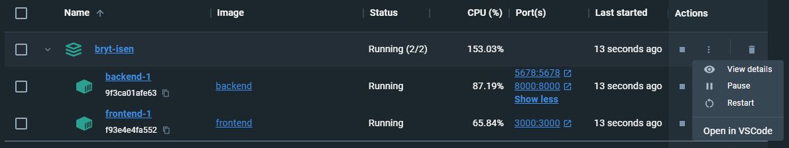

# Context for the project: (added september 2024)
Bryt-Isen was a project completed in the spring of 2024 by Anders Vestrum, Eirik Engen Kvam, Hannah Lervik, Jens Høie, Julie Amundsen Wolff, Mats Gaupset and Snorre Sæther.


The projects was part of the course [TDT4140 - Software Engineering](https://www.ntnu.edu/studies/courses/TDT4140#tab=omEmnet) at NTNU. The course has a focus on developing software as a team, where we learned Agile development methodes like Scrum and Kanban. In TDT4140 the teams are not determined by the students, and most of the groups consist of students from different study programs. All groups recive a project and a product-owner which have requirements for the product. The team consideres these requirements during the project in processes like Spirint planning.

### What Bryt-Isen aims to do (added september 2024)
The product owner presented a problem focusing on helping young people in social settings, especially in new and unfamiliar environments. There is a desire for the team to create a service where users can more easily build new acquaintances. This can come in the form of games and activities. For example, singing games, name games, and drinking games. Typical situations where these might be relevant include during orientation week, at festivals, and in student associations.

Based on this problem, we wanted to create a website where users can - through a structured and user-friendly experience - find various ice-breaker games. The games is distributed in predefined categories, but the site will also present a selection of games immediately upon opening the page. The website has a login function, which not only allows users to share their opinions about the games but also to contribute their own activities by providing names, rules, and a description of the activity. There is also the possibility of having an admin user who can manage all games and activities on the website.

For more information see the ["About Bryt-Isen" docs](./docs/domain-docs/Om-bryt-isen.md) *only in Norwegian*

For information about the tech-stack see the [Tech-stack docs](./docs/teori/teknologistakken.md)


### How to run the project (added september 2024)
*requires that you have docker installed*
1) Navigate to the root of this project (`/bryt-isen`) in your terminal
2) Run `docker compse build` from your terminal
3) Run `docker compse up` to start the containers
4) Go to localhost:3000 for the frontend, or localhost:8000 for the Django admin panel.


# 🧊⛏️Bryt-Isen

## Simple setup docs
*Detaljer lengre ned!*

Gruppen har brukt Docker🐋 for å kjøre utviklingsmiljøet og utviklings servere.

Prosjekte kjører som smurt hvis man :
1) Gå til docker sin hjemmeside, last ned docker dekstop.
2) Åpne Docker Desktop (og dermed Docker daemon)
3) Fra bryt-isen/ mappen, kjøre først `docker compose build`, når containeren er bygd, kjøre `docker compose up`
4) Frontend åpnes på lh:3000, backend på lh:8000

## Uten Docker:
### 1) 
```
git clone <prosjekt-URL>
```
### 2)
``` bash
# 👀fra frontend mappa (i bryt-isen/)
npm install
```
*Da det ikke har vært noe krav har vi ikke fokusert på at prosjeket skal "builde", så det er tvilsomt at det vil har noe for seg å prøve.*

### 3) - *om du ikke har pipenv*
``` bash
# 👀fra backend mappa (i bryt-isen/)
pip install pipenv
```

### 4) 
``` bash
# 👀fra backend/
pipenv install
```

### 5)
``` bash
# 👀fra backend/
pipenv run python manage.py makemigrations
```

### 6)
``` bash
# 👀fra backend/
pipenv run python manage.py migrate
```

### 7)
**Åpne en terminal i backend og en annen terminal i frontend**

#### 7.1)
``` bash
# 👀fra backend/
pipenv run python manage.py runserver
```
#### 7.2)
``` bash
# 👀fra frontend/
npm run dev
```
frontend åpnes på localhost:3000 og backend åpnes på localhost:8000

### Ekstra
For å lage superbruker i django kjører man: 
``` bash
# 👀fra backend/
pipenv run python manage.py createsuperuser
```
Med superbruker kan man benytte seg av admin-panalet på localhost:8000/admin


## Om prosjektet

*Det offisielle prosjektomfanget er definert i Forstudie og andre innleveringer.*

Bryt-Isen er et produkt som er ment å hjelpe unge mennesker i sosiale settinger, spesielt i nye og ukjente omgivelser.
Dette kan komme frem i form av leker og aktiviteter. For eksempel sangleker, navneleker og drikkeleker. Typiske situasjoner hvor disse kan være relevante er blant annet under fadderuke, på festivaler og i studentforeninger.

Bryt-Isen ønsker å leve opp til denne visjonen ved å la brukere finne ulike bli-kjent-leker gjennom en strukturert og brukervennlig opplevelse, samt annen funksjonalitet som at innloggede brukere kan vurdere bli-kjent-leker og favoritisere bli-kjent-leker. Brukere skal også kunne filtrere og søke på bli-kjent-leker. Det vil være mulig å rapportere upassende innhold, som administratorer kan slette.

#### [Bryt-Isen domene dokumentasjon](./docs/domain-docs/Om-bryt-isen.md)

## Oversikt

- [Context for the project: (added september 2024)](#context-for-the-project-added-september-2024)
    - [What Bryt-Isen aims to do (added september 2024)](#what-bryt-isen-aims-to-do-added-september-2024)
    - [How to run the project (added september 2024)](#how-to-run-the-project-added-september-2024)
- [🧊⛏️Bryt-Isen](#️bryt-isen)
  - [Simple setup docs](#simple-setup-docs)
  - [Uten Docker:](#uten-docker)
    - [1)](#1)
    - [2)](#2)
    - [3) - *om du ikke har pipenv*](#3---om-du-ikke-har-pipenv)
    - [4)](#4)
    - [5)](#5)
    - [6)](#6)
    - [7)](#7)
      - [7.1)](#71)
      - [7.2)](#72)
    - [Ekstra](#ekstra)
  - [Om prosjektet](#om-prosjektet)
      - [Bryt-Isen domene dokumentasjon](#bryt-isen-domene-dokumentasjon)
  - [Oversikt](#oversikt)
  - [Utviklingsmiljø \& teknologistakk](#utviklingsmiljø--teknologistakk)
    - [Backend 🐍](#backend-)
    - [Frontend ⌨️](#frontend-️)
    - [Virtuelt samkjørt miljø 🔮](#virtuelt-samkjørt-miljø-)
  - [Sett opp utviklingsmiljø](#sett-opp-utviklingsmiljø)
        - [Steg 1: klon🐑](#steg-1-klon)
        - [Steg 2: naviger til frontend 📁](#steg-2-naviger-til-frontend-)
        - [Steg 3: installer frontend avhengigheter📦](#steg-3-installer-frontend-avhengigheter)
          - [Kjør frontend server🚀](#kjør-frontend-server)
        - [Steg 4: naviger til backend 📁](#steg-4-naviger-til-backend-)
        - [Steg 5: installer pipenv📦](#steg-5-installer-pipenv)
        - [Steg 6: åpne pipenv shell 🐢](#steg-6-åpne-pipenv-shell-)
        - [Steg 7: installer backend avhengigheter📦](#steg-7-installer-backend-avhengigheter)
          - [Kjør backend server 🎸](#kjør-backend-server-)
  - [Kjør utviklingsmiljøet i Docker](#kjør-utviklingsmiljøet-i-docker)


**[Sjekk ut detaljert dokumentasjon.](./docs/content.md)**


## Utviklingsmiljø & teknologistakk

👋 For utvikling vil du bare trenge å bruke det som står i **[Kjør frontend server](#kjør-frontend-server)** og **[Kjør backend server](#kjør-backend-server-)**, etter du har gått gjennom steg 1 - 7 for å sette opp prosjektet.

**MEN,** det kan være ganske nice å heller **[bruke Docker for å kjøre utviklingsmiljøet virtuelt](#kjør-utviklingsmiljøet-i-docker--anbefales-)**.

### Backend 🐍

*Krever Python(pip, v. 12.1) og pipenv*

- 🎸[Django](https://www.djangoproject.com/start/)
- 🖽[Django REST Framework](https://www.django-rest-framework.org/)
- 🦮[Ruff (kode formattering og linting)](https://github.com/astral-sh/ruff)

### Frontend ⌨️

*Krever [Node.js](https://nodejs.org/en/learn/getting-started/introduction-to-nodejs)(v. 21.6), med [npm📦](https://docs.npmjs.com/about-npm). Kan være greit å ha [nvm](https://github.com/nvm-sh/nvm?tab=readme-ov-file#about), men dette er en smule herk i Windows*

- 🚀[Vite for å bygge React app](https://vitejs.dev/guide/)
- ⚛️[React](https://react.dev/learn)
- ⌨️[TypeScript](https://www.typescriptlang.org/)
- 🥾[Bootstrap](https://getbootstrap.com/)
- ✨[Prettier (kode formattering)](https://prettier.io/docs/en/install)
- 🔎 [ESlint (linter)](https://eslint.org/)

### Virtuelt samkjørt miljø 🔮

- 🐋[Docker](https://docs.docker.com/manuals/)

## Sett opp utviklingsmiljø

*Har du Python (pip) og Node.js (npm)? [Les mer om Python og Node.js krav.](./docs/teknologikrav.md)*

⚠️ Alle `kommandoer` kjøres i terminalen.


##### Steg 1: klon🐑

Klon prosjektet fra GitLab til en passende lokasjon på din datamaskin.

```
git clone <prosjekt-URL>
```

*Har laget et setup script. Litt usikker på hvor bra det funker, men i windows skal man kunne høyreklikke på `windows-setup.ps1 ` filen og velge å kjøre med powershell. Dette er ment å automatisk sette opp prosjektet. Igjen, det kreves at man har Node.js og Python satt opp riktig. For macOS kan du kjøre `macos-setup.sh` filen ved å skrive `./macos-setup.sh` i terminalen fra **bryt-isen** mappen.*

Hvis du ikke får startet [frontend](#kjør-frontend-server) og [backend](#kjør-backend-server-) serveren virket det ikke. Da burde du slette hele **bryt-isen** mappen, klone den på nytt og fortsette oppsettet manuelt. Altås steg 2 - 7.

💡Hvis det virket anbefales det å sjekke ut hvordan du kan bruke Docker videre: [bruke Docker for å kjøre utviklingsmiljøet virtuelt](#kjør-utviklingsmiljøet-i-docker--anbefales-)

##### Steg 2: naviger til frontend 📁

Gå til **bryt-isen** repoet du klonet. F.eks. med `cd bryt-isen`

Deretter til frontend med: `cd frontend`

##### Steg 3: installer frontend avhengigheter📦

Pakk ut frontend delen av prosjektet med node package manager (npm).

``` bash
# 👀fra frontend mappa
npm install
```

Dette installere alle avhengigheter som trengs i et utviklingsmiljø for å utvikle og kjøre frontend delen av prosjektet. `npm install` må kjøres fra mappen hvor *package.json* ligger.

###### Kjør frontend server🚀

*For å sjekke at steg 3 var suksessfult/for å åpne en lokal frontend server:*

``` bash
# 👀fra frontend/
npm run dev
```

💡Trykk `Ctrl + C` i terminalen for å stoppe serveren.

##### Steg 4: naviger til backend 📁

Gå ytters i **bryt-isen** repoet du klonet.
Hvis du er i frontend, bruk `cd ..` for å beveg deg et lag opp i mappestrukturen i terminalen.

##### Steg 5: installer pipenv📦

Installer Python pakke-administratoren pipenv med :

``` bash
# 👀fra backend mappa
pip install pipenv
```

*`pip` er Pythons pakke installatør.* 
💡 *Her kan det hende noen må bruke `pip3`*

##### Steg 6: åpne pipenv shell 🐢

For å installer og pakke ut Python-pakker må man åpne et virtuelt shell. Bruk:

``` bash
# 👀fra backend/
pipenv shell
```

##### Steg 7: installer backend avhengigheter📦

Installer backendavhengigheter, inkludert Django:

``` bash
# 👀fra backend/
pipenv install
```

###### Kjør backend server 🎸

*For å sjekke at steg 7 var suksessfult/for å åpne en lokal backend server:*
⚠️*pipenv shell må kjøre for at man skal kunne bruke Django kommandoer*.

``` bash
# 👀fra backend/
python manage.py runserver
```
Trykk `Ctrl + C` i terminalen for å stoppe serveren.

💡*Her kan det hende noen må bruke `python3`*

💡*Filen `manage.py` brukes i Python for å kjøre Django kommandoer*.


## Kjør utviklingsmiljøet i Docker

Docker🐋 er et verktøy for å kjøre (blant annet) utviklingsmiljøer virtuelt, sørge for at utviklingsmiljø variabler er konstant på forskjellige datamaskiner og for å strømmlinjeforme utviklingsprosessen.

⚠️ *etter å ha gjort steg 1 - 7 en gang, eller brukt setup-script*

**For å komme i gang med Docker: [last ned Docker Desktop her.](https://www.docker.com/products/docker-desktop/)**
Når ferdig nedlasted og installert, åpne Docker Desktop programmet. I Windows er det mulig man må sette opp Docker med Windows Subsystem for Linux. [For hjelp med dette, sjekk ut denne fremgangsmåten](https://www.digitalocean.com/community/tutorials/how-to-develop-a-docker-application-on-windows-using-wsl-visual-studio-code-and-docker-desktop), frem til (men ekskludert) den førte terminal kommandoen som blir nevnt.

1️⃣ Deretter gå til *bryt-isen* mappen i en terminal og kjør følgende:

``` bash
# 👀fra bryt-isen/
docker compose build
```

💡Dette bygger noe som kalles et Docker container, som inneholder det virutuelle utviklingsmiljøet. Vår Docker container skal inneholde to Docker images, ett for frontend og ett for backend.

2️⃣ Start Docker containeren (dette starter det virtuelle utvikler miljøet og frontend+backend serverene):

``` bash
# 👀fra bryt-isen/
docker compose up
```

💡Disse to kommandoene trenger du bare kjøre for å sette opp prosjektet i Docker. Videre kan du bruke Docker Desktop brukergrensesnittet for å starte frontend og backend serveren.

💡💡 Nå vil du se en oppdatering i brukergrensesnittet i Docker Desktop under "containers" som indikere at containeren med frontend og backend images kjører. Dette betyr at  Fra brukergrensesnittet kan du åpne localhost:3000 og localhost:8000, for å se det kjørende prosjektet i browser.

**Fordelen med å bruke Docker er at du bare trenger å forholde deg til Docker Desktop for å utvikle.** Altså trenger du ikke tenke på f.eks. `pipenv shell` eller å starte frontend/backend serverene fra terminalen. Når det kommer tid for å jobbe i backend kommer man til å måtte bruke terminalen litt mer, noe som kan gjøres enklere med Docker Desktop.

🚨 Åpne *bryt-isen* VScode i det virtuelle utviklermiljøet ved å trykke på de tre prikkene for *bryt-isen* Docker containeren:

